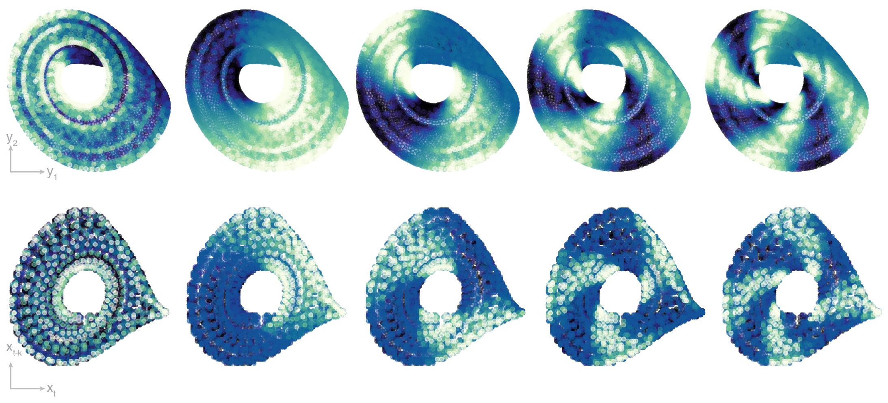

# icicl

In-context learning of transfer operators in transformers trained on dynamical systems.

### Dependencies

+ numpy
+ scipy
+ matplotlib
+ scikit-learn
+ torch

### Usage

The main experimental results are given by notebooks:

[`train_single_model.ipynb`](train_single_model.ipynb) is a notebook for training a small transformer on a single dynamical system, showing out-of-distribution performance and epochwise double descent.

[`measure_embedding_dimension.ipynb`](measure_embedding_dimension.ipynb) is a notebook for analyzing trained transformer to probe how the stable rank of attention rollouts and the closest-approximating Markov chain change with the embedding dimension.

[`estimate_transfer_operator.ipynb`](estimate_transfer_operator.ipynb) is a notebook for estimating the transfer operator of a trained model using time-delay embeddings, and comparing it to the ground truth transfer operator of the fully-observed test system.

[`icicl/`](icicl/) contains the utility functions for the experiments.

[`icicl/`](scripts/) contains batch scripts for running large scale experiments.

